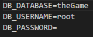
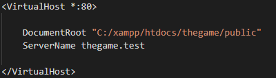

# TheGame

### A game where you name your games, add armies(named them and assign units to them) and apply strategies to said armies. 

    Avaliable strategies: 
     - Random(attacks random enemy)
     - Weakest(attacks weakest enemy)
     - Strongest(attacks strongest enemy)
     - If army doesn't have strategy, a random strategy is applied to it.

## Technologies used:
 - Ajax
 - Laravel(with Passport)

Registering a user is hardcoded in function called `register` in public folder in file called skripta.js. It is done for conveniency sake.
Rest of javascript methods are also located there.

### How to use:

 - To start "theGame", you'll need apache server with php installed. I used xampp. 
 - Create db named `theGame` with username=root and password="" in env file.

 

 - Put project folder in "htdocs" directory. 
 - Modify file at `C:\Windows\System32\drivers\etc` hosts, add `127.0.0.1 thegame.test` to it at the end. Also modify file at 

 

 or you can use "php artisan serve" ...

 - Start terminal and navigate to project directory.
 - Install Laravel passport by typing `composer require laravel/passport`.
 - Migrate migrations by typing `php artisan migrate`
 - Install passport by typing `php artisan passport:install --force`. It doesn't work without force flag, i messed it up on my previous attempts.

### Routes and parameters:

 - Register `/register`, data for registration is hardcoded in js method for simplicity.
 - Login `/login`, same as previous.

 #### Routes protected with Passport
 - Creates a game `/createGame`. It receives text data as name for game. Its json formated.
 - Adds a army to chosen game `/addArmy`. It receives game id to which it belongs now, army name and  army units number. Their js counterpart for activation is `addArmy(event)`.
 - List all games `listGames` with their respective armies and armies with their respective strategies. Their js counterpart for activation is `listGames(event)`.
 - Lists armies `/listArmies` with their strategies. Their js counterpart for activation is `listArmies(event)`.
 - Sets strategy for chosen army `/attackStrategy`. It receives army id and strategy which is number in this case taken from select-option. Their js counterpart for activation is `setStrategy(event)`. 
 - Send player to setup screen of games `/setupScreen`.
 - After setup, this route sends player to execution page `/battlefield`.
 - This route starts fight `/commenceBattle`. It receives game id.Their js counterpart for activation is `commenceBattle(event)`.

All of these protected routes also need token which is passed automatically from `login` method to global variable `token` from `skripta.js`. 

#### My Notice:

Since a game can have several armies, and if several armies can select same strategy which in turn makes both of them attack one army. By that account there can be more then one winner or at least one loser.

I tried setting counter variable  that counts how many armies still has units and if there are more than one, start loop again. It works partially i.e. ajax call for 50% of the time just times out.

So i decided to leave it as is. Aka, read first paragraph of "My Notice". Since at least, it doesn't time out ...
